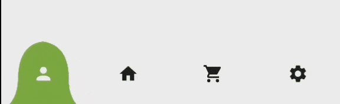

# Cap Navigation Bar

A flutter Package for awesome animated bottom navigation bar and support programatically navigation

## Preview

Dark mode navigation


Light mode navigation


## Getting started

add cap_navigation_bar in your flutter pubspec.yaml file

```dart
dependencies:
  cap_navigation_bar: //latest verison
```

import the package

```dart
import 'package:cap_navigation_bar/cap_navigation_bar.dart';

```

## Usage

in the state class create int proprety for holding and setting new value of index of the current page then use list of items. and use the index for the selected item color.

first create methode for item color

```dart
Color? itemColor(Color focusedIconColor, int index, int currentIndex,) {
  
  return index == currentIndex ? focusedIconColor : null;
}

```

then use it your class

```dart
class MainScreen extends StatefulWidget {
  const MainScreen({super.key});

  @override
  State<MainScreen> createState() => _MainScreenState();
}

class _MainScreenState extends State<MainScreen> {
  int selectedIndex = 0;
  @override
  Widget build(BuildContext context) {
    final scaffoldColor = Theme.of(context).scaffoldBackgroundColor;
    final icons = <IconData>[
      Icons.person,
      Icons.home,
      Icons.shopping_cart,
      Icons.settings,
    ];
    final items = List.generate(
      icons.length,
      (index) => Icon(
        icons[index],
        color: itemColor(scaffoldColor, index, selectedIndex),
      ),
    );

    final screens = <Widget>[
      const UserScreen(),
      const HomeScreen(),
      const FavoritesAndPurchasesScreen(),
      const SettingsScreen(),
    ];

    return SafeArea(
      child: Scaffold(
        body: screens[selectedIndex],
        bottomNavigationBar: CapNavigationBar(
          items: items,
          index: selectedIndex,
          onTap: (index) => setState(
            () => selectedIndex = index,
          ),
        ),
      ),
    );
  }
}

```

## Features

`items`: List of Widgets\
`index`: index of NavigationBar, can be used to change current index or to set initial index\
`color`: Color of NavigationBar, default Colors.white\
`capColor`: color of cap, default color is primary color\
`onTap`: Function handling taps on items\
`animationCurve`: Curves of the animation, default Curves.linear\
`animationDuration`: Duration of button change animation, default Duration(milliseconds: 600)\
`height`: height of bottom navigation bar\
`capHeight`: height of cap, default value is same as navigation height\
`capWidth`: width of cap

## Navigate to page anywhere in your code

You can navigate programmatically to a specific page index using the navigateToPage method in the CapNavigationKeyNotifier class anywhere in your code.

import the class

```dart
import 'package:cap_navigation_bar/navigation_key_notifier.dart';
```

then you can use the navigateToPage methode

```dart
    CapNavigationKeyNotifier().navigateToPage(2);
```

## Contribution

Contributions are welcome! Before submitting a Pull Request, please refrain from introducing additional dependencies.
